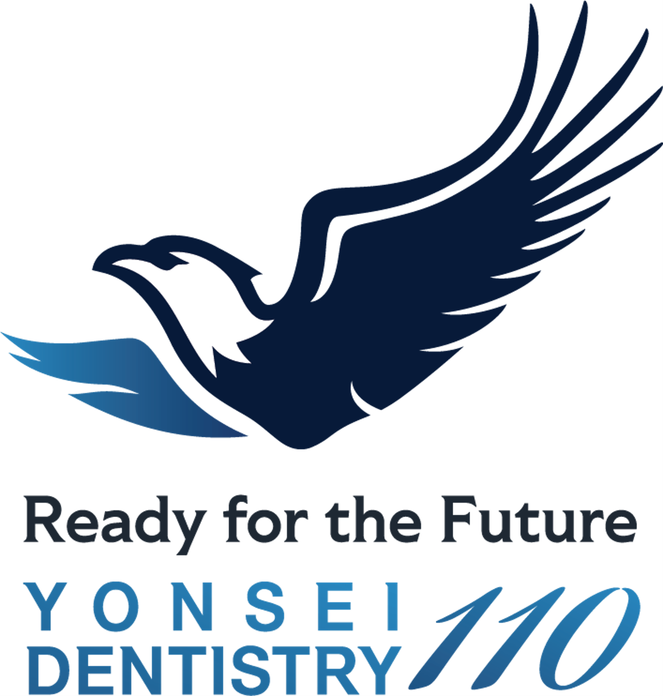

<header align="center">
	
</header>

	
	<h2 style="margin:100;flex:1;text-align:center;font-size:28px;line-height:30px;">Dynamic Abiotic Network for Modulating Microbial Communities and Reducing Virulence in Healing Tissues</h2>
	

**Authors:** Utkarsh Mangal1, Jae-Sung Kwon2, Dohyun Kim3, Sung-Hwan Choi4

**Affiliation:**1 Department of Oral Biology, 2 Department and Research Institute of Dental Biomaterials and Bioengineering, 3 Department of Conservative Dentistry, Oral Science Research Center, 4 Department of Orthodontics and Institute of Craniofacial Deformities
Yonsei University College of Dentistry, Seoul, Republic of Korea

---

**Abstract**
    Healing in oral tissues—particularly in the presence of comorbidities or advanced age—requires not only managing host tissue responses but also reshaping the resident microbiome. Currentbiomaterials often fall short in guiding microbial behavior, especially under anaerobic, inflammation-proneconditions dominated by Gram-negative pathogens.
    We introduce DYNAMO—a Dynamic Abiotic Network for Modulating Microbial Communities
—engineered tosuppress virulence-associated bacteria while maintaining a favorable microbial balance. Inspired by the nativemucosal phospholipid interface, this system integrates a collagen scaffold with a zwitterionic polymer matrixthat forms a soft, hydrated, and electrostatically dynamic interface. The resulting microenvironment resistsmicrobial adhesion, resists aggregation, and promotes planktonic dispersion of microorganisms.
    In a human-saliva oral microbiome model, DYNAMO resists microbial biomass penetration and modulatescommunity structure, showing selective suppression of Gram-negative taxa. Metagenomic profiling confirmed downregulation of virulence genes (e.g.,lpxC, luxS, fbp54 ) and pathways involved in lipopolysaccharide (LPS) biosynthesis, quorum sensing, and stress survival. Host fibroblast assays under LPS challenge revealedreduced inflammatory cytokine release and enhanced regenerative signaling, supporting both microbiomecompatibility and immunomodulatory benefit.
    Importantly, DYNAMO functions without antimicrobial agents or live bioactives, relying instead on biophysicalstimuli to modulate microbial ecology. Its efficacy under low-oxygen conditions, physical resilience, andmicrobial selectivity make it a promising scaffold for wound healing applications where microbiome balance iscritical.
This study positions DYNAMO as an abiotic interface for oral microbiome modulation, offering an antibiotic-freestrategy to control virulence and promote tissue regeneration.

KEYWORDS: Performance/Functionality/biomedical, Composition & Microstructure/Material Type/biomaterial,Performance/Material Form/biofilm.

	<h3 style="margin-bottom:20px;color:#333;">Get in Touch</h3>
	

		
		
	

**References**

1. K. Hou, Z.-X. Wu, X.-Y. Chen, J.-Q. Wang, D. Zhang, C. Xiao, D. Zhu, J. B. Koya, L. Wei, J. Li, Microbiota in health and diseases. *Signal transduction and targeted therapy* **7**, 1-28 (2022).

2. B. J. Kunath, C. De Rudder, C. C. Laczny, E. Letellier, P. Wilmes, The oral–gut microbiome axis in health and disease. *Nature Reviews Microbiology* **22**, 791-805 (2024).

3. T. Tuganbaev, K. Yoshida, K. Honda, The effects of oral microbiota on health. *Science* **376**, 934-936 (2022).

4. M. Zepeda-Rivera, S. S. Minot, H. Bouzek, H. Wu, A. Blanco-Míguez, P. Manghi, D. S. Jones, K. D. LaCourse, Y. Wu, E. F. McMahon, A distinct Fusobacterium nucleatum clade dominates the colorectal cancer niche. *Nature* **628**, 424-432 (2024).

5. X. Zhang, D. Zhang, H. Jia, Q. Feng, D. Wang, D. Liang, X. Wu, J. Li, L. Tang, Y. Li, The oral and gut microbiomes are perturbed in rheumatoid arthritis and partly normalized after treatment. *Nature medicine* **21**, 895-905 (2015).

6. A. Tonelli, E. N. Lumngwena, N. A. Ntusi, The oral microbiome in the pathophysiology of cardiovascular disease. *Nature Reviews Cardiology* **20**, 386-403 (2023).

7. Q. T. Easter, Z. Alvarado-Martinez, M. Kunz, B. F. Matuck, B. T. Rupp, T. Weaver, Z. Ren, A. Tata, J. Caballero-Perez, N. Oscarson, Polybacterial intracellular macromolecules shape single-cell inflammatory profiles in upper airway epithelia. *npj Biofilms and Microbiomes* **11**, 1-18 (2025).

8. L. A. Malard, A. Guisan, Into the microbial niche. *Trends in Ecology & Evolution* **38**, 936-945 (2023).

9. S. S. Justice, D. A. Hunstad, L. Cegelski, S. J. Hultgren, Morphological plasticity as a bacterial survival strategy. *Nature Reviews Microbiology* **6**, 162-168 (2008).

10. J. Hu, D. R. Amor, M. Barbier, G. Bunin, J. Gore, Emergent phases of ecological diversity and dynamics mapped in microcosms. *Science* **378**, 85-89 (2022).

11. J. Hu, M. Barbier, G. Bunin, J. Gore, Collective dynamical regimes predict invasion success and impacts in microbial communities. *Nature Ecology & Evolution*, 1-11 (2025).

12. J. Hasan, R. J. Crawford, E. P. Ivanova, Antibacterial surfaces: the quest for a new generation of biomaterials. *Trends in biotechnology* **31**, 295-304 (2013).

13. W. Choi, S. Park, J.-S. Kwon, E.-Y. Jang, J.-Y. Kim, J. Heo, Y. Hwang, B.-S. Kim, J.-H. Moon, S. Jung, Reverse actuation of polyelectrolyte effect for in vivo antifouling. *ACS nano* **15**, 6811-6828 (2021).

14. W. Choi, U. Mangal, J.-Y. Park, J.-Y. Kim, T. Jun, J. W. Jung, M. Choi, S. Jung, M. Lee, J.-Y. Na, Occlusive membranes for guided regeneration of inflamed tissue defects. *Nat. Commun.* **14**, 7687 (2023).

15. D.-W. Zheng, W.-W. Deng, W.-F. Song, C.-C. Wu, J. Liu, S. Hong, Z.-N. Zhuang, H. Cheng, Z.-J. Sun, X.-Z. Zhang, Biomaterial-mediated modulation of oral microbiota synergizes with PD-1 blockade in mice with oral squamous cell carcinoma. *Nature biomedical engineering* **6**, 32-43 (2022).

16. A.-N. Zhang, J. M. Gaston, P. Cárdenas, S. Zhao, X. Gu, E. J. J. C. G. Alm, CRISPR-Cas spacer acquisition is a rare event in human gut microbiome. *Cell Genomics* **5**, (2025).

17. K. Nan, V. R. Feig, B. Ying, J. G. Howarth, Z. Kang, Y. Yang, G. Traverso, Mucosa-interfacing electronics. *Nature Reviews Materials* **7**, 908-925 (2022).

18. N. Gill, M. Wlodarska, B. B. Finlay, The future of mucosal immunology: studying an integrated system-wide organ. *Nature immunology* **11**, 558-560 (2010).

19. A. Perez-Lopez, J. Behnsen, S.-P. Nuccio, M. Raffatellu, Mucosal immunity to pathogenic intestinal bacteria. *Nature Reviews Immunology* **16**, 135-148 (2016).

20. M. E. Johansson, G. C. Hansson, Immunological aspects of intestinal mucus and mucins. *Nature Reviews Immunology* **16**, 639-649 (2016).

21. M. Zasloff, Antimicrobial peptides of multicellular organisms. *Nature* **415**, 389-395 (2002).

22. K. M. Wheeler, G. Cárcamo-Oyarce, B. S. Turner, S. Dellos-Nolan, J. Y. Co, S. Lehoux, R. D. Cummings, D. J. Wozniak, K. Ribbeck, Mucin glycans attenuate the virulence of Pseudomonas aeruginosa in infection. *Nature microbiology* **4**, 2146-2154 (2019).

23. C. R. Bakshani, A. L. Morales-Garcia, M. Althaus, M. D. Wilcox, J. P. Pearson, J. C. Bythell, J. G. Burgess, Evolutionary conservation of the antimicrobial function of mucus: a first defence against infection. *npj Biofilms and Microbiomes* **4**, 14 (2018).

24. K. P. Rumbaugh, K. Sauer, Biofilm dispersion. *Nature Reviews Microbiology* **18**, 571-586 (2020).

25. H. Li, J. P. Limenitakis, T. Fuhrer, M. B. Geuking, M. A. Lawson, M. Wyss, S. Brugiroux, I. Keller, J. A. Macpherson, S. Rupp, The outer mucus layer hosts a distinct intestinal microbial niche. *Nature communications* **6**, 8292 (2015).

26. H. F. Chan, R. Zhao, G. A. Parada, H. Meng, K. W. Leong, L. G. Griffith, X. Zhao, Folding artificial mucosa with cell-laden hydrogels guided by mechanics models. *Proceedings of the National Academy of Sciences* **115**, 7503-7508 (2018).

27. R. Bej, R. Haag, Mucus-inspired dynamic hydrogels: Synthesis and future perspectives. *Journal of the American Chemical Society* **144**, 20137-20152 (2022).

28. J. Kang, X. Zhang, X. Yang, X. Yang, S. Wang, W. Song, Mucosa‐Inspired Electro‐Responsive Lubricating Supramolecular‐Covalent Hydrogel. *Advanced Materials* **35**, 2307705 (2023).

29. M. H. Bai, B. Zhao, Z. Y. T. Liu, Z. L. Zheng, X. Wei, L. Li, K. Li, X. Song, J. Z. Xu, Z. M. Li, Mucosa‐Like Conformal Hydrogel Coating for Aqueous Lubrication. *Advanced Materials* **34**, 2108848 (2022).

30. J. Joseph, H. M. Baby, J. R. Quintero, D. Kenney, Y. A. Mebratu, E. Bhatia, P. Shah, K. Swain, D. Lee, S. Kaur, Toward a Radically Simple Multi‐Modal Nasal Spray for Preventing Respiratory Infections. *Advanced Materials*, 2406348 (2024).

31. X. Mei, J. Li, Z. Wang, D. Zhu, K. Huang, S. Hu, K. D. Popowski, K. Cheng, An inhaled bioadhesive hydrogel to shield non-human primates from SARS-CoV-2 infection. *Nature materials* **22**, 903-912 (2023).

32. R. Bej, C. A. Stevens, C. Nie, K. Ludwig, G. D. Degen, Y. Kerkhoff, M. Pigaleva, J. M. Adler, N. A. Bustos, T. M. Page, Mucus‐Inspired Self‐Healing Hydrogels: A Protective Barrier for Cells against Viral Infection. *Advanced Materials* **36**, 2401745 (2024).

33. B. Eshaghi, A. Schudel, I. Sadeghi, Z. Chen, A. H. Lee, M. Kanelli, F. Tierney, J. Han, B. Ingalls, D. M. Francis, The role of engineered materials in mucosal vaccination strategies. *Nature Reviews Materials* **9**, 29-45 (2024).

34. M. A. McGuckin, S. K. Lindén, P. Sutton, T. H. Florin, Mucin dynamics and enteric pathogens. *Nature Reviews Microbiology* **9**, 265-278 (2011).

35. G. D. Degen, C. A. Stevens, G. Cárcamo-Oyarce, J. Song, R. Bej, P. Tang, K. Ribbeck, R. Haag, G. H. McKinley, Mussel-inspired cross-linking mechanisms enhance gelation and adhesion of multifunctional mucin-derived hydrogels. *Proceedings of the National Academy of Sciences* **122**, e2415927122 (2025).

36. S. K. Lai, Y.-Y. Wang, D. Wirtz, J. Hanes, Micro-and macrorheology of mucus. *Advanced drug delivery reviews* **61**, 86-100 (2009).

37. S. K. Lai, D. E. O'Hanlon, S. Harrold, S. T. Man, Y.-Y. Wang, R. Cone, J. Hanes, Rapid transport of large polymeric nanoparticles in fresh undiluted human mucus. *Proceedings of the National Academy of Sciences* **104**, 1482-1487 (2007).

38. F. Lorandi, M. Fantin, K. Matyjaszewski, Atom transfer radical polymerization: a mechanistic perspective. *Journal of the American Chemical Society* **144**, 15413-15430 (2022).

39. Y. Yu, H. Yuk, G. A. Parada, Y. Wu, X. Liu, C. S. Nabzdyk, K. Youcef‐Toumi, J. Zang, X. Zhao, Multifunctional “hydrogel skins” on diverse polymers with arbitrary shapes. *Adv. Mater.* **31**, 1807101 (2019).

40. S. Nam, B. R. Seo, A. J. Najibi, S. L. McNamara, D. J. Mooney, Active tissue adhesive activates mechanosensors and prevents muscle atrophy. *Nat. Mater.* **22**, 249-259 (2023).

41. Q. Li, C. Wen, J. Yang, X. Zhou, Y. Zhu, J. Zheng, G. Cheng, J. Bai, T. Xu, J. Ji, Zwitterionic biomaterials. *Chemical reviews* **122**, 17073-17154 (2022).

42. O. Chaudhuri, J. Cooper-White, P. A. Janmey, D. J. Mooney, V. B. Shenoy, Effects of extracellular matrix viscoelasticity on cellular behaviour. *Nature* **584**, 535-546 (2020).

43. D. Kavishvar, A. Ramachandran, The yielding behaviour of human mucus. *Advances in Colloid and Interface Science* **322**, 103049 (2023).

44. F. Burla, Y. Mulla, B. E. Vos, A. Aufderhorst-Roberts, G. H. Koenderink, From mechanical resilience to active material properties in biopolymer networks. *Nature Reviews Physics* **1**, 249-263 (2019).

45. W. Choi, M. Lee, H. Yong, D. Heo, T. Jun, H. Ryu, J.-Y. Kim, D. Cui, D. Y. Ryu, S.-Y. Lee, Anisotropic Liesegang pattern for the nonlinear elastic biomineral-hydrogel complex. *Science Advances* **10**, eadl3075 (2024).

46. W. Choi, J. Jin, S. Park, J.-Y. Kim, M.-J. Lee, H. Sun, J.-S. Kwon, H. Lee, S.-H. Choi, J. Hong, Quantitative interpretation of hydration dynamics enabled the fabrication of a zwitterionic antifouling surface. *ACS applied materials & interfaces* **12**, 7951-7965 (2020).

47. C. Werlang, G. Cárcarmo-Oyarce, K. Ribbeck, Engineering mucus to study and influence the microbiome. *Nature Reviews Materials* **4**, 134-145 (2019).

48. P. Zhou, D. Manoil, G. N. Belibasakis, G. A. Kotsakis, Veillonellae: beyond bridging species in oral biofilm ecology. *Frontiers in Oral Health* **2**, 774115 (2021).

49. P. Marsh, E. Zaura, Dental biofilm: ecological interactions in health and disease. *Journal of clinical periodontology* **44**, S12-S22 (2017).

50. W. H. Bowen, R. A. Burne, H. Wu, H. Koo, Oral biofilms: pathogens, matrix, and polymicrobial interactions in microenvironments. *Trends in microbiology* **26**, 229-242 (2018).

51. N. Drakes, G. Kondrikova, D. Pytel, E. D. Hamlett, Unveiling the Intricate Link Between Anaerobe Niche and Alzheimer Disease Pathogenesis. *The Journal of Infectious Diseases* **230**, S117-S127 (2024).

52. G. Hajishengallis, R. P. Darveau, M. A. Curtis, The keystone-pathogen hypothesis. *Nature reviews microbiology* **10**, 717-725 (2012).

53. B. Liu, D. Zheng, S. Zhou, L. Chen, J. Yang, VFDB 2022: a general classification scheme for bacterial virulence factors. *Nucleic acids research* **50**, D912-D917 (2022).

54. I. Fetzer, K. Johst, R. Schäwe, T. Banitz, H. Harms, A. Chatzinotas, The extent of functional redundancy changes as species’ roles shift in different environments. *Proceedings of the National Academy of Sciences* **112**, 14888-14893 (2015).

55. W. Dong, X. Fan, Y. Guo, S. Wang, S. Jia, N. Lv, T. Yuan, Y. Pan, Y. Xue, X. Chen, An expanded database and analytical toolkit for identifying bacterial virulence factors and their associations with chronic diseases. *Nature Communications* **15**, 8084 (2024).

56. H. Koo, R. N. Allan, R. P. Howlin, P. Stoodley, L. Hall-Stoodley, Targeting microbial biofilms: current and prospective therapeutic strategies. *Nature Reviews Microbiology* **15**, 740-755 (2017).

57. A. Vendeville, K. Winzer, K. Heurlier, C. M. Tang, K. R. Hardie, Making'sense'of metabolism: autoinducer-2, LuxS and pathogenic bacteria. *Nature Reviews Microbiology* **3**, 383-396 (2005).

58. K. Sauer, P. Stoodley, D. M. Goeres, L. Hall-Stoodley, M. Burmølle, P. S. Stewart, T. Bjarnsholt, The biofilm life cycle: expanding the conceptual model of biofilm formation. *Nature Reviews Microbiology* **20**, 608-620 (2022).

59. A. B. Russell, S. B. Peterson, J. D. Mougous, Type VI secretion system effectors: poisons with a purpose. *Nature reviews microbiology* **12**, 137-148 (2014).

60. R. J. Lamont, H. Koo, G. Hajishengallis, The oral microbiota: dynamic communities and host interactions. *Nature reviews microbiology* **16**, 745-759 (2018).

61. H.-C. Flemming, E. D. van Hullebusch, B. J. Little, T. R. Neu, P. H. Nielsen, T. Seviour, P. Stoodley, J. Wingender, S. Wuertz, Microbial extracellular polymeric substances in the environment, technology and medicine. *Nature Reviews Microbiology*, 1-19 (2024).

62. A. O. Gaca, J. A. Lemos, Adaptation to adversity: the intermingling of stress tolerance and pathogenesis in enterococci. *Microbiology and Molecular Biology Reviews* **83**, 10.1128/mmbr. 00008-00019 (2019).

63. M. F. Moradali, M. E. Davey, Metabolic plasticity enables lifestyle transitions of Porphyromonas gingivalis. *npj Biofilms and Microbiomes* **7**, 46 (2021).

64. V. Sperandio, Virulence or competition? *Science* **336**, 1238-1239 (2012).

65. A. Duran-Pinedo, J. Solbiati, F. Teles, R. Teles, Y. Zang, J. Frias-Lopez, Long-term dynamics of the human oral microbiome during clinical disease progression. *BMC biology* **19**, 1-17 (2021).

66. K. D. Zeise, R. J. Woods, G. B. Huffnagle, Interplay between Candida albicans and lactic acid bacteria in the gastrointestinal tract: impact on colonization resistance, microbial carriage, opportunistic infection, and host immunity. *Clinical microbiology reviews* **34**, e00323-00320 (2021).

67. B. E. Coggins, X. Li, A. L. McClerren, O. Hindsgaul, C. R. Raetz, P. Zhou, Structure of the LpxC deacetylase with a bound substrate-analog inhibitor. *Nature Structural & Molecular Biology* **10**, 645-651 (2003).

68. T. S. Schmidt, M. R. Hayward, L. P. Coelho, S. S. Li, P. I. Costea, A. Y. Voigt, J. Wirbel, O. M. Maistrenko, R. J. Alves, E. Bergsten, Extensive transmission of microbes along the gastrointestinal tract. *elife* **8**, e42693 (2019).

69. O. Takeuchi, K. Hoshino, T. Kawai, H. Sanjo, H. Takada, T. Ogawa, K. Takeda, S. Akira, Differential roles of TLR2 and TLR4 in recognition of gram-negative and gram-positive bacterial cell wall components. *Immunity* **11**, 443-451 (1999).

70. A. Pardo, M. Selman, MMP-1: the elder of the family. *The international journal of biochemistry & cell biology* **37**, 283-288 (2005).

71. S. Jalili-Firoozinezhad, F. S. Gazzaniga, E. L. Calamari, D. M. Camacho, C. W. Fadel, A. Bein, B. Swenor, B. Nestor, M. J. Cronce, A. Tovaglieri, A complex human gut microbiome cultured in an anaerobic intestine-on-a-chip. *Nature biomedical engineering* **3**, 520-531 (2019).

72. E. I. Lamont, A. Gadkari, K. A. Kerns, T. T. To, D. Daubert, G. Kotsakis, B. Bor, X. He, J. S. McLean, Modified SHI medium supports growth of a disease‐state subgingival polymicrobial community in vitro. *Molecular oral microbiology* **36**, 37-49 (2021).

73. S. M. Pratik Jagtap, Ray Sajulga, Bérénice Batut, Emma Leith, Praveen Kumar, Saskia Hiltemann, . (2021), vol. 2024.

74. S. Xu, L. Zhan, W. Tang, Q. Wang, Z. Dai, L. Zhou, T. Feng, M. Chen, T. Wu, E. Hu, MicrobiotaProcess: A comprehensive R package for deep mining microbiome. *The Innovation* **4**, (2023).

75. M. Feldgarden, V. Brover, N. Gonzalez-Escalona, J. G. Frye, J. Haendiges, D. H. Haft, M. Hoffmann, J. B. Pettengill, A. B. Prasad, G. E. Tillman, AMRFinderPlus and the Reference Gene Catalog facilitate examination of the genomic links among antimicrobial resistance, stress response, and virulence. *Scientific reports* **11**, 12728 (2021).

76. A. Weimann, K. Mooren, J. Frank, P. B. Pope, A. Bremges, A. C. McHardy, From genomes to phenotypes: Traitar, the microbial trait analyzer. *MSystems* **1**, 10.1128/msystems. 00101-00116 (2016).

